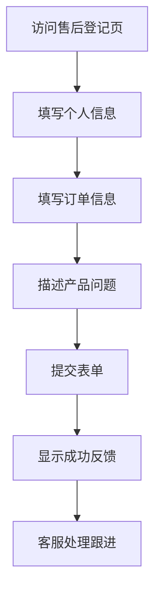

## 1. 产品概述
Romantic Crown售后登记服务单页，为用户提供优雅简洁的售后信息登记体验。用户可通过该页面提交售后申请，系统将自动收集并存储用户信息，为后续售后服务提供数据支持。

品牌定位：高端时尚品牌，追求极致优雅与专业服务的完美结合。

## 2. 核心功能

### 2.1 用户角色
| 角色 | 注册方式 | 核心权限 |
|------|----------|----------|
| 普通用户 | 无需注册，直接填写表单 | 提交售后申请、查看提交确认 |

### 2.2 功能模块
售后登记页面包含以下核心功能：
1. **售后登记表单**：客户信息录入、订单信息验证、问题描述提交
2. **提交确认反馈**：优雅的成功提示与后续服务指引

### 2.3 页面详情
| 页面名称 | 模块名称 | 功能描述 |
|-----------|-------------|-------------|
| 售后登记页 | 品牌标识区 | 展示Romantic Crown品牌logo，营造高端品牌形象 |
| 售后登记页 | 表单标题区 | 显示"售后登记服务"标题，配以简洁副标题说明 |
| 售后登记页 | 客户信息录入 | 输入客户姓名、联系电话/邮箱，支持格式验证 |
| 售后登记页 | 订单信息录入 | 输入订单编号、产品名称，确保信息准确性 |
| 售后登记页 | 问题描述区 | 多行文本框描述产品问题，支持字数统计 |
| 售后登记页 | 提交按钮 | 金色提交按钮，点击后显示加载状态 |
| 售后登记页 | 成功反馈 | 优雅的成功提示，告知处理时效与联系方式 |

## 3. 核心流程
用户访问售后登记页面 → 填写个人信息（姓名、联系方式）→ 填写订单信息（订单号、产品名称）→ 详细描述问题 → 提交表单 → 系统确认反馈 → 客服后续跟进

## 4. 用户界面设计

### 4.1 设计风格
- **主色调**：纯黑（#000000）、纯白（#FFFFFF）、香槟金（#D4AF37）
- **按钮样式**：极简矩形设计，金色悬停效果，圆角2px
- **字体选择**：英文字体优先使用Playfair Display，中文使用思源黑体
- **布局风格**：极致留白，居中对齐，单栏布局，内容区域最大宽度800px
- **图标风格**：线性图标，金色点缀，保持视觉一致性

### 4.2 页面设计概览
| 页面名称 | 模块名称 | UI元素 |
|-----------|-------------|-------------|
| 售后登记页 | 品牌标识区 | 顶部居中显示Romantic Crown标志，字体优雅，金色标识 |
| 售后登记页 | 表单容器 | 白色卡片背景，微妙阴影效果，内部大量留白 |
| 售后登记页 | 输入框设计 | 细黑边框，金色聚焦状态，圆角4px，高度48px |
| 售后登记页 | 提交按钮 | 金色背景，白色文字，悬停时深金色变化 |
| 售后登记页 | 反馈提示 | 优雅的成功图标配简洁文字，居中显示 |

### 4.3 响应式设计
桌面端优先设计，完美适配1200px以上屏幕。移动端自适应，保持单栏布局，触摸友好的大按钮设计，确保在小屏幕上依然保持优雅简约的视觉效果。

### 4.4 交互细节
- 表单聚焦时显示金色边框动画
- 提交按钮点击后显示优雅加载动画
- 成功提交后页面平滑滚动到反馈区域
- 所有交互元素都有悬停状态反馈