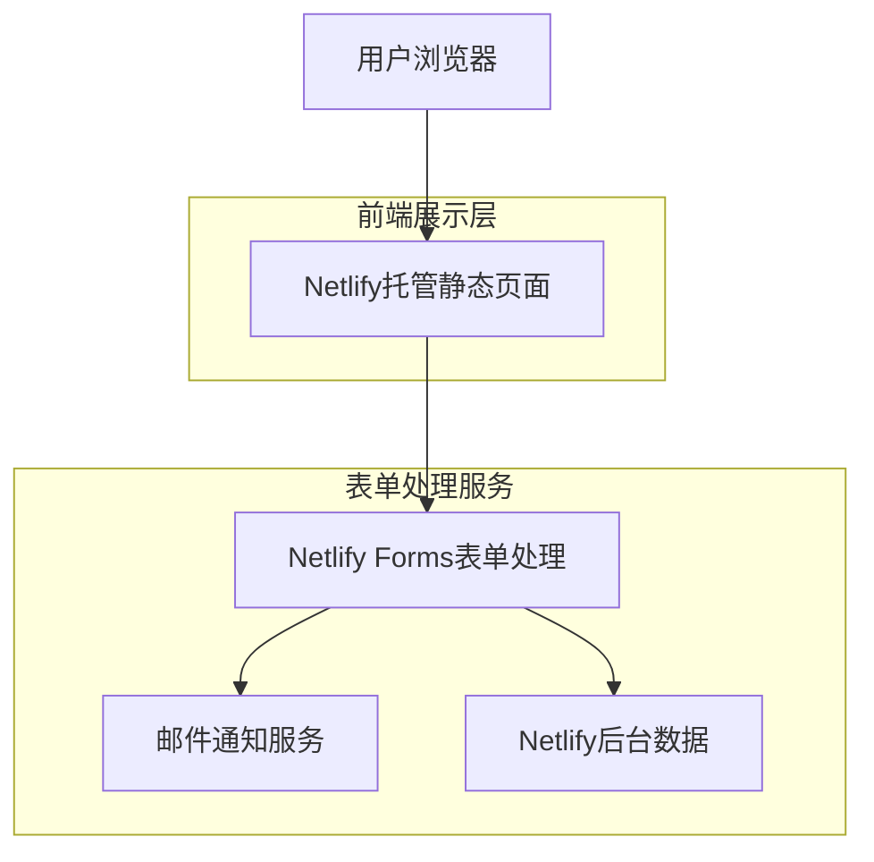

## 1. 架构设计



## 2. 技术描述

- **前端**: HTML5 + CSS3 + JavaScript (原生)
- **部署平台**: Netlify静态托管
- **表单处理**: Netlify Forms (内置表单处理服务)
- **通知机制**: Netlify Forms自动邮件通知
- **域名**: 使用Netlify提供的免费域名或自定义域名

## 3. 路由定义

| 路由 | 用途 |
|-------|---------|
| /index.html | 售后登记主页面，包含完整的登记表单 |
| /success.html | 提交成功确认页面（可选，也可使用同页反馈） |
| /thank-you.html | 感谢页面，提供后续服务指引 |

## 4. 表单配置说明

### 4.1 Netlify Forms配置
在表单标签中添加以下属性：
```html
<form name="after-sales-registration" 
      method="POST" 
      data-netlify="true"
      data-netlify-honeypot="bot-field">
```

### 4.2 表单字段定义
| 字段名称 | 字段类型 | 是否必填 | 验证规则 |
|-----------|-------------|-------------|-------------|
| customer_name | text | 是 | 最小长度2字符，最大长度50字符 |
| contact_info | text | 是 | 手机号或邮箱格式验证 |
| order_id | text | 是 | 订单号格式验证 |
| product_name | text | 是 | 产品名称，最大长度100字符 |
| issue_description | textarea | 是 | 最小长度10字符，最大长度1000字符 |

### 4.3 通知设置
在Netlify控制台配置：
- 表单提交通知邮箱：service@romanticcrown.com
- 自动回复邮件模板（可选）
- 垃圾邮件防护：启用honey-pot字段

## 5. 静态资源结构

```
romantic-crown-after-sales/
├── index.html          # 主页面
├── css/
│   └── styles.css      # 样式文件
├── js/
│   └── main.js         # 表单验证脚本
├── images/
│   └── logo.png        # 品牌logo
├── thank-you.html      # 感谢页面
└── netlify.toml        # Netlify配置文件
```

## 6. 部署配置

### 6.1 netlify.toml配置
```toml
[build]
  publish = "."
  command = "echo 'No build step required'"

[[redirects]]
  from = "/success"
  to = "/thank-you.html"
  status = 200
```

### 6.2 环境变量（可选）
- 自定义邮件模板ID
- 表单处理webhook URL（如需要集成其他服务）

## 7. 性能优化

- 启用Netlify CDN加速
- 压缩CSS和JavaScript文件
- 优化图片资源（使用WebP格式）
- 设置适当的缓存策略
- 启用HTTP/2支持

## 8. 监控与分析

- 集成Google Analytics进行访问统计
- 设置Netlify表单提交监控
- 配置错误页面（404.html）
- 启用Netlify性能监控